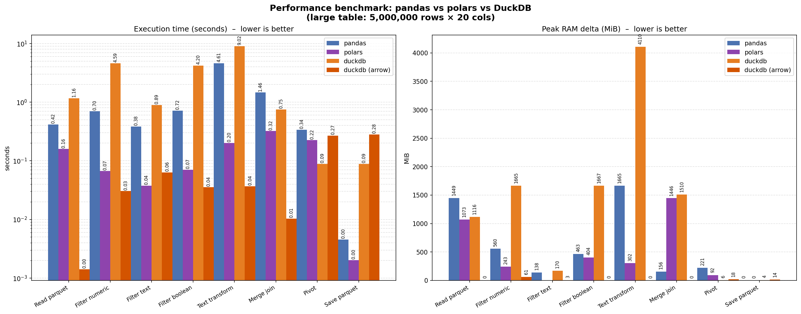

# Test de performance entre Pandas, Polars y DuckDB

## Motivación

Este test, compara las tres librerías analizando su tiempo de ejecución y consumo máximo de memoria RAM.

## Entorno

Librerías de Python

```toml {title="pyproject.toml"}
[project]
name = "performance"
version = "0.1.0"
readme = "README.md"
requires-python = ">=3.14"
dependencies = [
    "duckdb>=1.4.4",
    "pandas>=3.0.1",
    "polars>=1.38.1",
    "pyarrow>=19.0.0",
    "psutil>=6.0.0",
]
```

Ordenador

```
System          Windows 11 64-bit
Processor	    Intel(R) Core(TM) i9-10885H CPU @ 2.40GHz (2.40 GHz)
Installed RAM	32.0 GB
```

## Resultados

```
(performance) PS C:\performance> uv run .\main.py
============================================================================
  Performance benchmark: pandas vs polars vs DuckDB
  Large table: 5,000,000 rows × 20 cols
  Small table: 10,000 rows × 10 cols
============================================================================

  Deleted 6 existing parquet file(s):
    large_table.parquet
    output_duckdb.parquet
    output_duckdb_without_fetch.parquet
    output_pandas.parquet
    output_polars.parquet
    small_table.parquet

► Generating datasets …

  Building small_table.parquet  (10 000 rows × 10 cols) …
    Saved → small_table.parquet  (0.5 MiB)
  Building large_table.parquet  (5 000 000 rows × 20 cols) …
    Saved → large_table.parquet  (262.6 MiB)


────────────────────────────────────────────────────────────────────────────
  PANDAS
────────────────────────────────────────────────────────────────────────────
    Operation                                                 Time    Peak RAM
    ──────────────────────────────────────────────────── ─────────   ─────────
    Read large parquet                                      0.417 s     1449.0 MiB
    Filter numeric  (num_1 > 500)                           0.699 s      560.2 MiB
    Filter text  (text_3 starts with 'a')                   0.383 s      138.0 MiB
    Filter boolean  (bool_1 == True)                        0.717 s      462.6 MiB
    Text transform  (upper + first word)                    4.605 s     1664.8 MiB
    Merge inner join  (on text_1)                           1.462 s      156.1 MiB
    Pivot  (bool_2 × text_2, mean num_1)                    0.339 s      220.9 MiB
    Save pivot → output_pandas.parquet                      0.005 s        0.0 MiB

────────────────────────────────────────────────────────────────────────────
  POLARS
────────────────────────────────────────────────────────────────────────────
    Operation                                                 Time    Peak RAM
    ──────────────────────────────────────────────────── ─────────   ─────────
    Read large parquet                                      0.159 s     1072.5 MiB
    Filter numeric  (num_1 > 500)                           0.067 s      242.8 MiB
    Filter text  (text_3 starts with 'a')                   0.038 s        0.0 MiB
    Filter boolean  (bool_1 == True)                        0.070 s      404.5 MiB
    Text transform  (upper + first word)                    0.201 s      302.3 MiB
    Merge inner join  (on text_1)                           0.321 s     1445.9 MiB
    Pivot  (bool_2 × text_2, mean num_1)                    0.224 s       92.2 MiB
    Save pivot → output_polars.parquet                      0.002 s        0.0 MiB

────────────────────────────────────────────────────────────────────────────
  DUCKDB
────────────────────────────────────────────────────────────────────────────
    Operation                                                 Time    Peak RAM
    ──────────────────────────────────────────────────── ─────────   ─────────
    Read large parquet (→ in-memory table)                  1.163 s     1115.8 MiB
    Filter numeric  (num_1 > 500)                           4.589 s     1664.7 MiB
    Filter text  (text_3 starts with 'a')                   0.893 s      170.2 MiB
    Filter boolean  (bool_1 == True)                        4.200 s     1667.0 MiB
    Text transform  (upper + first word)                    9.024 s     4110.0 MiB
    Merge inner join  (on text_1)                           0.754 s     1509.7 MiB
    Pivot  (bool_2 × text_2, mean num_1)                    0.089 s        6.0 MiB
    Save pivot → output_duckdb.parquet                      0.089 s        3.5 MiB

────────────────────────────────────────────────────────────────────────────
  DUCKDB (NATIVE & ARROW)
────────────────────────────────────────────────────────────────────────────
    Operation                                                 Time    Peak RAM
    ──────────────────────────────────────────────────── ─────────   ─────────
    Read large parquet (→ virtual view)                     0.001 s        0.1 MiB
    Filter numeric  (num_1 > 500)                           0.030 s       61.2 MiB
    Filter text  (text_3 starts with 'a')                   0.063 s        2.9 MiB
    Filter boolean  (bool_1 == True)                        0.035 s        0.0 MiB
    Text transform  (upper + first word)                    0.037 s        0.1 MiB
    Merge inner join  (on text_1)                           0.010 s        0.3 MiB
    Pivot  (bool_2 × text_2, mean num_1)                    0.269 s       18.2 MiB
    Save pivot → output_duckdb_without_fetch.parquet        0.282 s       13.7 MiB

────────────────────────────────────────────────────────────────────────────
  Done.  Output files:
    output_duckdb.parquet  (0.80 KiB)
    output_duckdb_without_fetch.parquet  (0.80 KiB)
    output_pandas.parquet  (3.57 KiB)
    output_polars.parquet  (1.71 KiB)
────────────────────────────────────────────────────────────────────────────


  Chart saved → benchmark_chart.png
```

## Conclusion



En orden, recomendaría por performance:
1. DuckDB exportando a tablas Arrow
2. Polars
3. Pandas
4. DuckDB exportando a DataFrames

En orden, recomendaría por simplicidad de uso:
1. Pandas
2. Polars
3. DuckDB exportando a DataFrames
4. DuckDB exportando a tablas Arrow

Nota:
* DuckDB -en el caso *Arrow*- acumula el trabajo en los pasos baratos y lo ejecuta todo junto en pivot/save